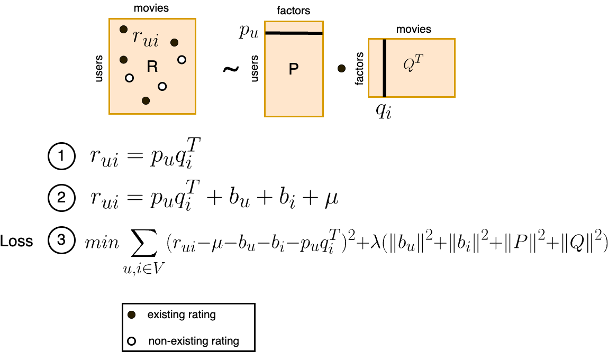
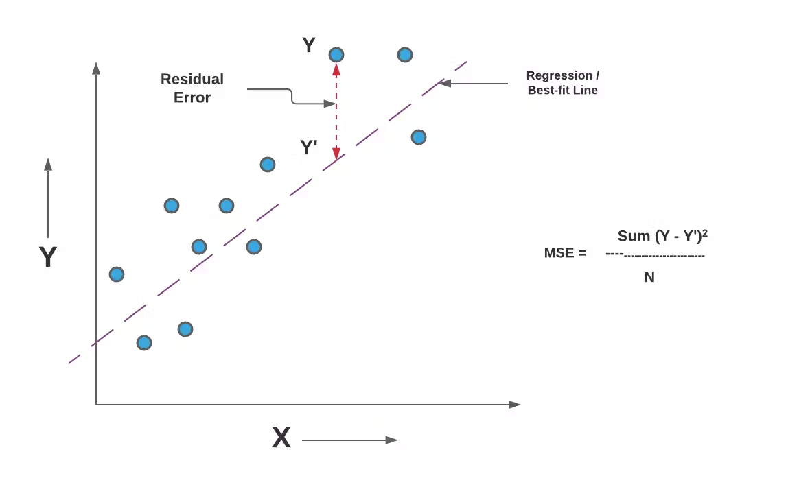

# Movie Watcher App

A Flask-based application that loads movie data and user watch history into a DuckDB database, then exposes this data through API endpoints. This project demonstrates the integration of Flask with DuckDB, allowing you to interact with movie data and user interactions.

## Features
- Loads movie data, including genres, from a CSV file and stores it in a DuckDB database.
- Loads user data and watched movies from another CSV file and stores it in the database.
- Exposes API endpoints to:
  - Retrieve all data of a specific user (including their watched movies).
  - Retrieve a list of movies watched by a particular user.
  - Retrieve all data of a particular movie (including its genres).

## Installation

### Prerequisites
- Python 3.x
- DuckDB
- Flask
- Faker (for generating user names)

### Setup

1. Clone the repository:

    ```bash
    git clone https://github.tlcinternal.com/tpresa/movie-rec
    cd mf-recommender
    ```

2. Copy the dataset folder `the-movie-dataset` to folder `mf-recommender`.
   
3. Create a virtual environment (optional but recommended):

    ```bash
    python -m venv venv
    ```

4. Activate the virtual environment:

    ```bash
    source venv/bin/activate
    ```

5. Install the dependencies:

    ```bash
    pip install -r requirements.txt
    ```

6. Make sure the movie and ratings data are available in the `the-movies-dataset` folder.

7. Prepair recommendations. It will generate the file `ratings.duckdb` and `recs.pkl`. It will take less then a minute to run.
    ```bash
    python train.py
    ```

8. Run the application. If the first time, it will take about 3 minutes create duckdb file `movies.db`. Next time, it will just use the existing file.

    ```bash
    python app.py
    ```

    This will start the Flask development server at `http://127.0.0.1:5000/`.

    In case you want to reload database, run like this:
    ```bash
    FORCE_LOAD="True" python app.py
    ```

    **Important observation**: When using `docker-compose`, it is better to load `movies.db` already built into the container. 

## Endpoints

1. **Get all data of a particular user**

   **Endpoint**: `/user/<int:user_id>`<br>
   **Method**: `GET`<br>
   **Example**:<br>
   ```bash
   curl http://127.0.0.1:5000/user/11
   ```

2. **Get movies watched by a user**

    **Endpoint**: `/user/<int:user_id>/movies`<br>
    **Method**: `GET`<br>
    **Example**:<br>

    ```bash
    curl http://127.0.0.1:5000/user/862/movies
    ```
    This will return the list of movie titles watched by the user.

3. **Get all data of a particular movie**

    **Endpoint**: `/movie/<int:movie_id>`<br>
    **Method**: GET<br>
    **Example**:<br>

    ```bash
    curl http://127.0.0.1:5000/movie/862
    curl http://127.0.0.1:5000/movie/31357
    ```
    This will return the movie data (original title, genres).

4. **Search for a movie that matches keyworkd list**

    **Endpoint**: `/search_movies/<int:movie_id>`<br>
    **Method**: GET<br>
    **Example**:<br>

    ```bash
    curl http://127.0.0.1:5000/search_movies/the,matrix
    curl http://127.0.0.1:5000/search_movies/the,silence,lambs
    ```
    This will return the list of movies whose title match the all keywords (original title, genres, year, watched_count). `watched_count` is the number of users which watched/evaluated this movie.


5. **Return recommendations of a user**

    **Endpoint**: `/recommendations/<int:user_id>`<br>
    **Method**: GET<br>
    **Example**:<br>

    ```bash
    curl http://127.0.0.1:5000/recommendations/1
    curl http://127.0.0.1:5000/recommendations/2
    ```
    This will return the list of recommended movies for this user_id (original title, genres, year).

## Appendix
### Matrix Factorization


---

### MSE
